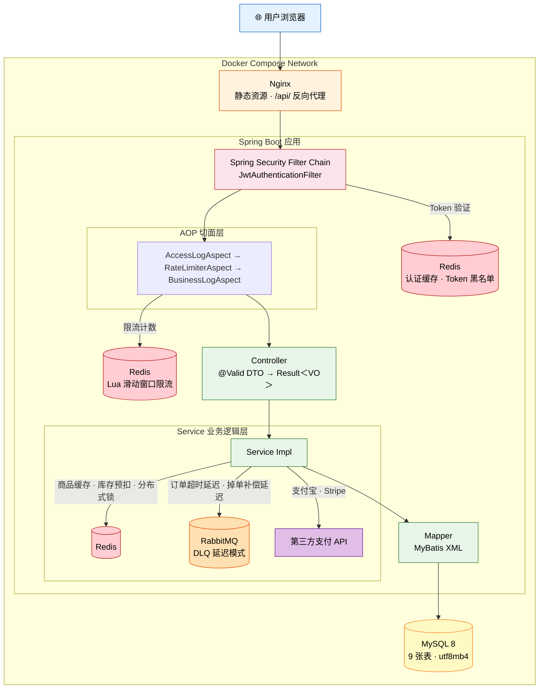
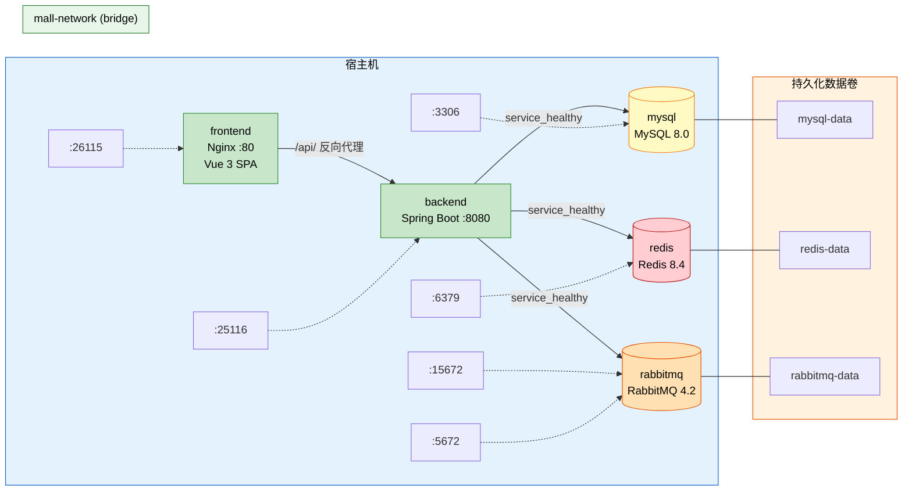
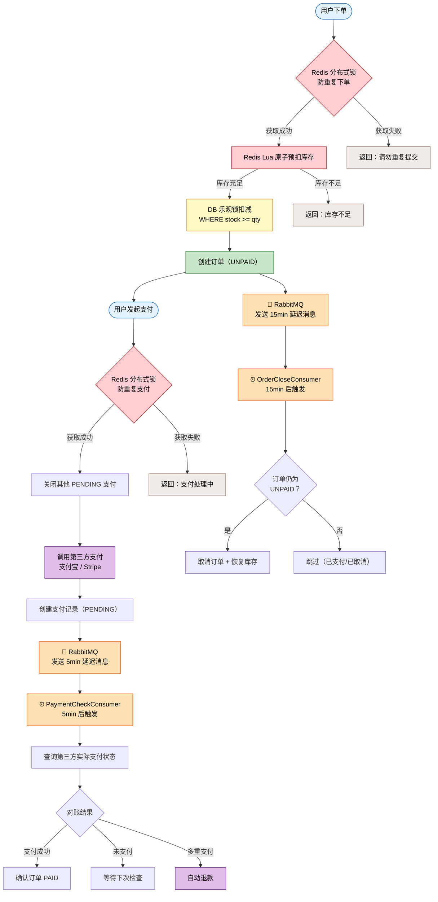

# 系统架构

## 分层架构（请求链路全景）

展示一个请求从用户浏览器到数据库的完整链路，以及 Redis / RabbitMQ 在各层的交互位置。

---

## 基础设施拓扑（Docker Compose）

展示 5 个容器的网络关系、端口映射、数据卷和启动依赖。

---

## 核心业务流程（订单生命周期）

展示下单 → 库存预扣 → 支付 → 掉单补偿 → 超时关单 → 退款的完整链路，标注 Redis 和 RabbitMQ 在每个环节的作用。

**图例**：🔴 Redis 相关 · 🟠 RabbitMQ 相关 · 🟢 业务主流程 · 🟣 第三方支付 · 🟡 数据库操作
