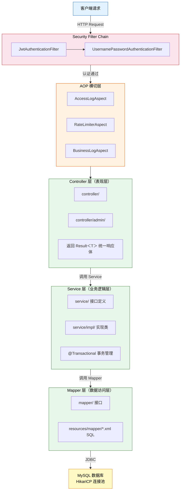
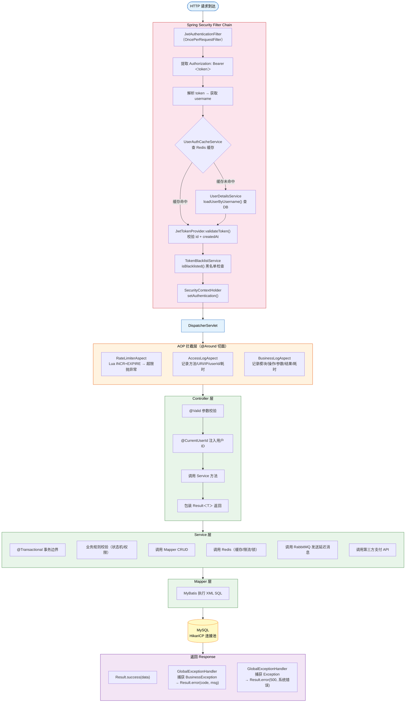

# 后端分层架构设计

## 目录

- [分层架构图](#分层架构图)
- [各包职责说明](#各包职责说明)
- [请求处理完整链路](#请求处理完整链路)
- [命名规范](#命名规范)
- [MapStruct 转换器使用模式](#mapstruct-转换器使用模式)

---

## 分层架构图



---

## Packges职责说明

| 包目录 | 职责 | 代表文件示例 |
|--------|------|-------------|
| `controller/` | HTTP 接口层，处理请求参数，调用 Service，统一返回 `Result<T>` | `ProductController.java` |
| `controller/admin/` | 管理员专用接口，需 `ADMIN` 角色，含商品/分类/订单管理 | `AdminProductController.java` |
| `service/` | 业务逻辑接口定义，声明方法契约 | `OrderService.java` |
| `service/impl/` | 业务逻辑实现，含事务管理、外部服务调用 | `OrderServiceImpl.java` |
| `mapper/` | MyBatis Mapper 接口，与 XML 对应 | `OrderMapper.java` |
| `entity/` | 数据库实体类（DO 对象），字段与数据库列一一对应 | `OrderDO.java` |
| `dto/` | 请求入参封装，含 Bean Validation 注解 | `CreateOrderDTO.java` |
| `vo/` | 返回给前端的视图对象，脱敏/关联字段已处理 | `OrderVO.java` |
| `converter/` | MapStruct 转换器，负责 DO ↔ VO 映射 | `OrderConverter.java` |
| `common/` | 共享枚举、常量、`Result<T>` 包装类、`ResultCode` | `OrderStatus.java` |
| `config/` | Spring Boot 配置类（Security、Swagger、Redis 等） | `SecurityConfig.java` |
| `security/` | JWT 过滤器、Token 提供者、UserDetails 实现 | `JwtAuthenticationFilter.java` |
| `exception/` | 业务异常类和全局异常处理 | `GlobalExceptionHandler.java` |
| `aspect/` | AOP 切面：访问日志、业务日志、限流 | `RateLimiterAspect.java` |
| `annotation/` | 自定义注解：`@CurrentUserId`、`@RateLimiter`、`@LogOperation` | `CurrentUserId.java` |
| `util/` | 通用工具类：Redis 操作封装、分布式锁等 | `RedisDistributedLock.java` |
| `mq/` | RabbitMQ 生产者/消费者 | `OrderCloseConsumer.java` |
| `filter/` | Servlet 过滤器（IP 获取等辅助 Filter） | - |

---

## 请求处理完整链路



---

## 命名规范

### 对象类型规范

| 后缀 | 含义 | 使用场景 |
|------|------|---------|
| `DO`（Data Object）| 数据库实体 | `entity/` 包，字段与数据库列对应，不对外暴露 |
| `DTO`（Data Transfer Object）| 请求传输对象 | `dto/` 包，接收前端请求体，含校验注解 |
| `VO`（View Object）| 视图响应对象 | `vo/` 包，返回给前端，字段已处理（脱敏/扁平化）|
| `Converter` | 对象转换器 | `converter/` 包，使用 MapStruct 实现 DO ↔ VO 映射 |

### 类命名规范

| 类型 | 命名模式 | 示例 |
|------|---------|------|
| 实体类 | `{业务}DO` | `OrderDO`、`ProductDO` |
| 请求 DTO | `{操作}{业务}DTO` | `CreateOrderDTO`、`UpdateProductDTO` |
| 响应 VO | `{业务}VO` | `OrderVO`、`ProductVO` |
| Service 接口 | `{业务}Service` | `OrderService` |
| Service 实现 | `{业务}ServiceImpl` | `OrderServiceImpl` |
| Mapper 接口 | `{业务}Mapper` | `OrderMapper` |
| Controller | `{业务}Controller` | `OrderController` |
| 转换器 | `{业务}Converter` | `OrderConverter` |

### 接口路径规范

所有接口以 `/api/v1/` 为前缀：

| 路径前缀 | 访问权限 | 说明 |
|---------|---------|------|
| `/api/v1/auth/**` | 公开 | 登录、注册、刷新 Token |
| `/api/v1/products/**` | 公开（查询）/ ADMIN（管理）| 商品相关 |
| `/api/v1/categories/**` | 公开（查询）/ ADMIN（管理）| 分类相关 |
| `/api/v1/user/**` | USER 角色 | 订单、购物车、地址、个人信息 |
| `/api/v1/admin/**` | ADMIN 角色 | 后台管理接口 |
| `/api/v1/payment/**` | 认证用户（回调公开）| 支付相关 |

---

## MapStruct 转换器使用模式

本项目使用 MapStruct 实现 DO 到 VO 的对象映射，所有 Converter 均在 `converter/` 包下以接口形式定义，并通过 `@Mapper(componentModel = "spring")` 注入到 Spring 容器。

### 基本映射模式

字段名称一致时 MapStruct 自动映射，字段名不一致或需要忽略时通过 `@Mapping` 注解指定：

```java
// ProductConverter.java
@Mapper(componentModel = "spring")
public interface ProductConverter {

    // 忽略 categoryName 字段（后续由 default 方法手动填充）
    @Mapping(target = "categoryName", ignore = true)
    ProductVO toVO(ProductDO product);
}
```

### 关联数据填充模式（避免 N+1）

当 VO 中需要填充关联表数据时，使用 `default` 方法扩展：

```java
// ProductConverter.java —— 批量转换，使用 IN 查询避免 N+1
default List<ProductVO> toVOList(List<ProductDO> products, CategoryMapper categoryMapper) {
    // 1. 收集所有唯一 categoryId
    List<Long> categoryIds = products.stream()
            .map(ProductDO::getCategoryId)
            .distinct().collect(Collectors.toList());

    // 2. 批量查询分类（一次 SQL）
    Map<Long, CategoryDO> categoryMap = categoryMapper.findByIds(categoryIds).stream()
            .collect(Collectors.toMap(CategoryDO::getId, c -> c));

    // 3. 从 Map 缓存填充 categoryName
    return products.stream()
            .map(product -> {
                ProductVO vo = toVO(product);
                CategoryDO category = categoryMap.get(product.getCategoryId());
                if (category != null) vo.setCategoryName(category.getName());
                return vo;
            }).collect(Collectors.toList());
}
```

### 复杂枚举转换模式

需要将枚举 code 转换为描述文字时，通过 `default` 方法包装：

```java
// OrderConverter.java
default OrderVO toVOComplete(OrderDO order) {
    OrderVO vo = toVO(order);
    try {
        OrderStatus orderStatus = OrderStatus.fromCode(order.getStatus());
        vo.setStatusDesc(orderStatus.getDescription());
    } catch (IllegalArgumentException e) {
        vo.setStatusDesc(order.getStatus()); // fallback 到原始 code
    }
    return vo;
}
```

### 条件性关联加载模式

当需要按场景决定是否加载关联数据（如订单明细）时：

```java
// OrderConverter.java —— 加载订单明细
default OrderVO toVOWithItems(OrderDO order,
                               OrderItemMapper orderItemMapper,
                               OrderItemConverter orderItemConverter) {
    OrderVO vo = toVOComplete(order);
    if (order.getId() != null) {
        List<OrderItemVO> items = orderItemMapper.findByOrderId(order.getId())
                .stream()
                .map(orderItemConverter::toVO)
                .collect(Collectors.toList());
        vo.setItems(items);
    }
    return vo;
}
```

### 各 Converter 职责概览

| 转换器 | 主要转换方向 | 特殊处理 |
|--------|------------|---------|
| `ProductConverter` | `ProductDO` → `ProductVO` | 批量查分类，避免 N+1 |
| `OrderConverter` | `OrderDO` → `OrderVO` | 状态枚举描述转换，条件性加载 items |
| `OrderItemConverter` | `OrderItemDO` → `OrderItemVO` | 基础字段映射 |
| `CartItemConverter` | `CartItemDO` → `CartItemVO` | 基础字段映射 |
| `UserConverter` | `UserDO` → `UserVO` | 排除 password 字段 |
| `AddressConverter` | `AddressDO` → `AddressVO` | 基础字段映射 |
| `CategoryConverter` | `CategoryDO` → `CategoryVO` | 基础字段映射 |
