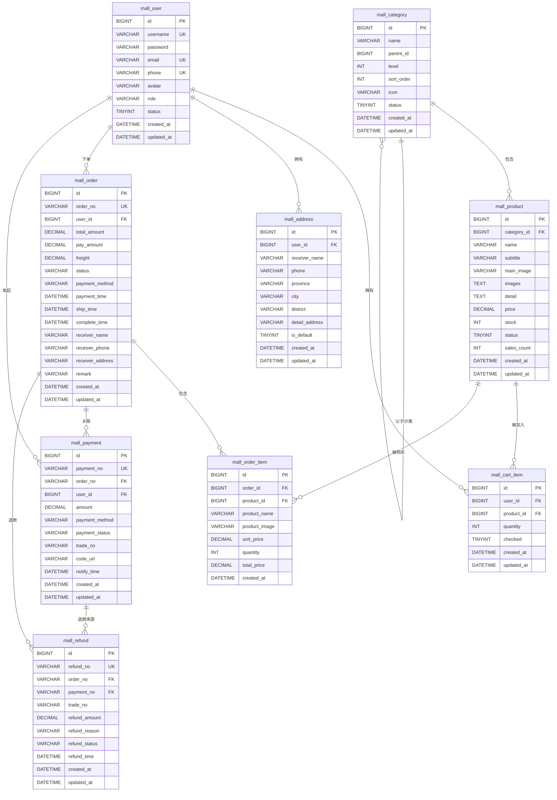

# 数据库设计文档

## 目录

- [ER 关系图](#er-关系图)
- [数据表详细说明](#数据表详细说明)
- [关键设计决策](#关键设计决策)

---

## ER 关系图

---

## 数据表详细说明

### 1. 用户表 `mall_user`

存储用户基本信息，支持角色区分（USER/ADMIN）。

| 字段 | 类型 | 约束 | 说明 |
|------|------|------|------|
| `id` | BIGINT | PK, AUTO_INCREMENT | 用户 ID |
| `username` | VARCHAR(50) | NOT NULL, UNIQUE | 用户名，全局唯一 |
| `password` | VARCHAR(255) | NOT NULL | BCrypt 加密密码 |
| `email` | VARCHAR(100) | UNIQUE | 邮箱，唯一约束允许 NULL |
| `phone` | VARCHAR(20) | UNIQUE | 手机号，唯一约束允许 NULL |
| `avatar` | VARCHAR(500) | - | 头像 URL |
| `role` | VARCHAR(20) | NOT NULL, DEFAULT 'USER' | 角色：USER / ADMIN |
| `status` | TINYINT | NOT NULL, DEFAULT 1 | 0=禁用 / 1=正常 |
| `created_at` | DATETIME | NOT NULL | 创建时间（用于 JWT 验证） |
| `updated_at` | DATETIME | NOT NULL, ON UPDATE | 更新时间 |

**索引：**
- `uk_username`：用户名唯一索引
- `uk_email`：邮箱唯一索引
- `uk_phone`：手机号唯一索引

---

### 2. 商品分类表 `mall_category`

支持多级分类（最多三级），通过 `parent_id` 自关联实现树形结构。

| 字段 | 类型 | 约束 | 说明 |
|------|------|------|------|
| `id` | BIGINT | PK, AUTO_INCREMENT | 分类 ID |
| `name` | VARCHAR(100) | NOT NULL | 分类名称 |
| `parent_id` | BIGINT | DEFAULT 0 | 父分类 ID；0 表示顶级分类 |
| `level` | INT | NOT NULL, DEFAULT 1 | 层级：1=一级 / 2=二级 / 3=三级 |
| `sort_order` | INT | DEFAULT 0 | 排序值（越小越靠前）|
| `icon` | VARCHAR(500) | - | 分类图标 URL |
| `status` | TINYINT | NOT NULL, DEFAULT 1 | 0=禁用 / 1=正常 |
| `created_at` | DATETIME | NOT NULL | 创建时间 |
| `updated_at` | DATETIME | NOT NULL, ON UPDATE | 更新时间 |

**索引：**
- `idx_parent_id`：父分类 ID 索引，加速树形查询

---

### 3. 商品表 `mall_product`

存储商品详细信息，库存字段同时被 Redis 缓存以支持高并发扣减。

| 字段 | 类型 | 约束 | 说明 |
|------|------|------|------|
| `id` | BIGINT | PK, AUTO_INCREMENT | 商品 ID |
| `category_id` | BIGINT | NOT NULL | 所属分类 ID |
| `name` | VARCHAR(200) | NOT NULL | 商品名称 |
| `subtitle` | VARCHAR(500) | - | 副标题 |
| `main_image` | VARCHAR(500) | - | 主图 URL |
| `images` | TEXT | - | 图片列表（JSON 数组格式） |
| `detail` | TEXT | - | 商品详情（HTML 富文本） |
| `price` | DECIMAL(10,2) | NOT NULL | 商品价格 |
| `stock` | INT | NOT NULL, DEFAULT 0 | 库存数量 |
| `status` | TINYINT | NOT NULL, DEFAULT 1 | 0=下架 / 1=上架 |
| `sales_count` | INT | NOT NULL, DEFAULT 0 | 累计销量（冗余字段）|
| `created_at` | DATETIME | NOT NULL | 创建时间 |
| `updated_at` | DATETIME | NOT NULL, ON UPDATE | 更新时间 |

**索引：**
- `idx_category_id`：分类查询索引
- `idx_status`：上下架状态过滤索引

---

### 4. 购物车表 `mall_cart_item`

记录用户购物车中的商品，用户和商品组合唯一。

| 字段 | 类型 | 约束 | 说明 |
|------|------|------|------|
| `id` | BIGINT | PK, AUTO_INCREMENT | 购物车条目 ID |
| `user_id` | BIGINT | NOT NULL | 用户 ID |
| `product_id` | BIGINT | NOT NULL | 商品 ID |
| `quantity` | INT | NOT NULL, DEFAULT 1 | 数量 |
| `checked` | TINYINT | NOT NULL, DEFAULT 1 | 0=未选中 / 1=选中 |
| `created_at` | DATETIME | NOT NULL | 创建时间 |
| `updated_at` | DATETIME | NOT NULL, ON UPDATE | 更新时间 |

**索引：**
- `uk_user_product`：(user_id, product_id) 联合唯一索引，防止重复添加
- `idx_user_id`：用户购物车查询索引

---

### 5. 收货地址表 `mall_address`

用户收货地址，支持多地址和默认地址标记。

| 字段 | 类型 | 约束 | 说明 |
|------|------|------|------|
| `id` | BIGINT | PK, AUTO_INCREMENT | 地址 ID |
| `user_id` | BIGINT | NOT NULL | 用户 ID |
| `receiver_name` | VARCHAR(50) | NOT NULL | 收货人姓名 |
| `phone` | VARCHAR(20) | NOT NULL | 联系电话 |
| `province` | VARCHAR(50) | NOT NULL | 省份 |
| `city` | VARCHAR(50) | NOT NULL | 城市 |
| `district` | VARCHAR(50) | NOT NULL | 区县 |
| `detail_address` | VARCHAR(200) | NOT NULL | 详细地址 |
| `is_default` | TINYINT | NOT NULL, DEFAULT 0 | 0=非默认 / 1=默认地址 |
| `created_at` | DATETIME | NOT NULL | 创建时间 |
| `updated_at` | DATETIME | NOT NULL, ON UPDATE | 更新时间 |

**索引：**
- `idx_user_id`：用户地址列表查询索引

---

### 6. 订单主表 `mall_order`

记录订单核心信息，收货地址冗余存储以支持历史回溯。

| 字段 | 类型 | 约束 | 说明 |
|------|------|------|------|
| `id` | BIGINT | PK, AUTO_INCREMENT | 订单 ID |
| `order_no` | VARCHAR(50) | NOT NULL, UNIQUE | 订单号（业务唯一标识）|
| `user_id` | BIGINT | NOT NULL | 下单用户 ID |
| `total_amount` | DECIMAL(10,2) | NOT NULL | 订单总金额 |
| `pay_amount` | DECIMAL(10,2) | NOT NULL | 实付金额 |
| `freight` | DECIMAL(10,2) | NOT NULL, DEFAULT 0.00 | 运费 |
| `status` | VARCHAR(20) | NOT NULL, DEFAULT 'UNPAID' | 订单状态（见状态机文档）|
| `payment_method` | VARCHAR(20) | - | 支付方式：ALIPAY / STRIPE |
| `payment_time` | DATETIME | - | 支付时间 |
| `ship_time` | DATETIME | - | 发货时间 |
| `complete_time` | DATETIME | - | 完成时间 |
| `receiver_name` | VARCHAR(50) | NOT NULL | 收货人姓名（冗余）|
| `receiver_phone` | VARCHAR(20) | NOT NULL | 收货人电话（冗余）|
| `receiver_address` | VARCHAR(500) | NOT NULL | 收货地址完整字符串（冗余）|
| `remark` | VARCHAR(500) | - | 订单备注 |
| `created_at` | DATETIME | NOT NULL | 创建时间 |
| `updated_at` | DATETIME | NOT NULL, ON UPDATE | 更新时间 |

**索引：**
- `uk_order_no`：订单号唯一索引，支付回调查询用
- `idx_user_id`：用户订单列表查询索引
- `idx_status`：订单状态过滤索引
- `idx_created_at`：按时间排序索引

---

### 7. 订单明细表 `mall_order_item`

记录订单中每个商品的快照，商品名称和图片冗余存储防止商品变更影响历史订单。

| 字段 | 类型 | 约束 | 说明 |
|------|------|------|------|
| `id` | BIGINT | PK, AUTO_INCREMENT | 明细 ID |
| `order_id` | BIGINT | NOT NULL | 订单 ID |
| `product_id` | BIGINT | NOT NULL | 商品 ID |
| `product_name` | VARCHAR(200) | NOT NULL | 商品名称（冗余快照）|
| `product_image` | VARCHAR(500) | - | 商品图片（冗余快照）|
| `unit_price` | DECIMAL(10,2) | NOT NULL | 下单时单价（冗余快照）|
| `quantity` | INT | NOT NULL | 数量 |
| `total_price` | DECIMAL(10,2) | NOT NULL | 明细总价（unit_price × quantity）|
| `created_at` | DATETIME | NOT NULL | 创建时间 |

**索引：**
- `idx_order_id`：订单明细查询索引
- `idx_product_id`：商品维度统计索引

---

### 8. 支付记录表 `mall_payment`

记录每次支付尝试，支持一个订单对应多条支付记录（换支付方式重新支付）。

| 字段 | 类型 | 约束 | 说明 |
|------|------|------|------|
| `id` | BIGINT | PK, AUTO_INCREMENT | 支付 ID |
| `payment_no` | VARCHAR(50) | NOT NULL, UNIQUE | 支付流水号（与第三方交互的 out_trade_no）|
| `order_no` | VARCHAR(50) | NOT NULL | 关联订单号 |
| `user_id` | BIGINT | NOT NULL | 用户 ID |
| `amount` | DECIMAL(10,2) | NOT NULL | 支付金额 |
| `payment_method` | VARCHAR(20) | NOT NULL | 支付方式：ALIPAY / STRIPE |
| `payment_status` | VARCHAR(20) | NOT NULL, DEFAULT 'PENDING' | 支付状态（见状态机文档）|
| `trade_no` | VARCHAR(200) | - | 第三方交易号（Stripe Session ID 可能超长）|
| `code_url` | VARCHAR(500) | - | 支付二维码链接或 Stripe Checkout URL |
| `notify_time` | DATETIME | - | 异步通知到达时间 |
| `created_at` | DATETIME | NOT NULL | 创建时间 |
| `updated_at` | DATETIME | NOT NULL, ON UPDATE | 更新时间 |

**索引：**
- `uk_payment_no`：支付流水号唯一索引
- `idx_order_no`：订单维度查询索引
- `idx_user_id`：用户支付记录查询索引
- `idx_payment_status`：状态过滤索引（掉单补偿查 PENDING 记录）

---

### 9. 退款记录表 `mall_refund`

记录退款流程，支持部分退款和多次退款记录。

| 字段 | 类型 | 约束 | 说明 |
|------|------|------|------|
| `id` | BIGINT | PK, AUTO_INCREMENT | 退款 ID |
| `refund_no` | VARCHAR(50) | NOT NULL, UNIQUE | 退款流水号 |
| `order_no` | VARCHAR(50) | NOT NULL | 关联订单号 |
| `payment_no` | VARCHAR(50) | NOT NULL | 关联支付流水号 |
| `trade_no` | VARCHAR(200) | - | 第三方交易号 |
| `refund_amount` | DECIMAL(10,2) | NOT NULL | 退款金额 |
| `refund_reason` | VARCHAR(500) | - | 退款原因 |
| `refund_status` | VARCHAR(20) | NOT NULL, DEFAULT 'PENDING' | PENDING / PROCESSING / SUCCESS / FAILED |
| `refund_time` | DATETIME | - | 退款成功时间 |
| `created_at` | DATETIME | NOT NULL | 创建时间 |
| `updated_at` | DATETIME | NOT NULL, ON UPDATE | 更新时间 |

**索引：**
- `uk_refund_no`：退款流水号唯一索引
- `idx_order_no`：订单维度查询索引
- `idx_payment_no`：支付记录维度查询索引
- `idx_refund_status`：状态过滤索引

---

## 关键设计决策

### 1. 硬删除策略

本项目所有表均采用**硬删除**（直接 DELETE）而非软删除（`is_deleted` 标记位）。

**决策理由：**
- 商品、分类、购物车等数据的历史状态通过订单明细的冗余字段保留
- 避免软删除带来的"条件查询复杂化"和"唯一索引失效"问题
- 订单、支付、退款为业务核心数据，由业务状态机管理生命周期，不需要删除

### 2. 订单收货地址冗余存储

`mall_order` 表冗余存储了 `receiver_name`、`receiver_phone`、`receiver_address` 三个字段，而非关联 `mall_address` 表。

**决策理由：**
- 用户下单后修改/删除收货地址，不影响历史订单显示
- 避免查询订单时 JOIN 地址表，减少 SQL 复杂度

### 3. 订单明细商品信息冗余

`mall_order_item` 冗余存储了 `product_name`、`product_image`、`unit_price`，而非实时查 `mall_product`。

**决策理由：**
- 商品下架、改价后，历史订单仍能正确显示下单时的商品信息
- 避免商品表变更影响订单数据完整性

### 4. 支付流水与订单分离

一个订单（`mall_order`）可以对应多条支付记录（`mall_payment`），例如用户先选择支付宝支付，后取消改用 Stripe 支付。

**关联方式：** `mall_payment.order_no` → `mall_order.order_no`（非 FK，避免级联锁影响）

### 5. utf8mb4 字符集

所有表均使用 `utf8mb4` 字符集 + `utf8mb4_unicode_ci` 排序规则。

**决策理由：**
- 支持 4 字节 Unicode 字符（包括 Emoji）
- `unicode_ci` 大小写不敏感，满足用户名比对需求

### 6. `trade_no` 字段长度设计

`mall_payment.trade_no` 和 `mall_refund.trade_no` 使用 `VARCHAR(200)` 而非常规的 `VARCHAR(50)`。

**决策理由：**
- Stripe Checkout Session ID 格式为 `cs_live_xxx...`，长度可超过 100 字符
- 支付宝 `trade_no` 约 28 字符，微信 `transaction_id` 约 32 字符
- 统一设计为 200 字节以兼容所有第三方

### 7. 自增主键 vs UUID

所有表主键均使用 `BIGINT AUTO_INCREMENT`，业务唯一标识（订单号、支付流水号）通过 `OrderNoGenerator` 生成雪花算法风格的字符串，作为独立字段存储。

**决策理由：**
- 自增主键聚集索引效率高，避免 UUID 随机插入导致的页分裂
- 业务流水号通过独立字段对外暴露，不暴露内部自增 ID
