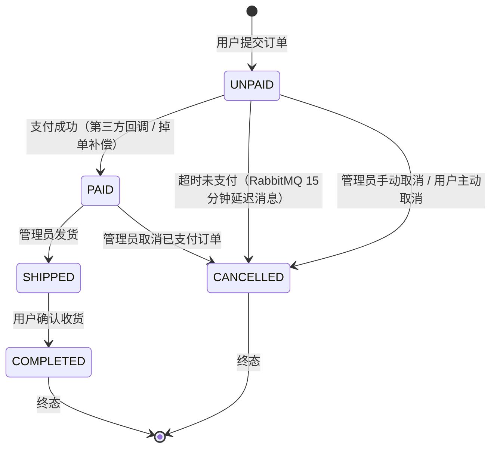
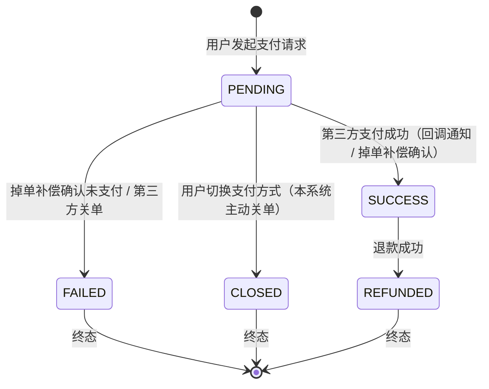

# 订单与支付状态机

## 目录

- [订单状态转换图](#订单状态转换图)
- [支付状态转换图](#支付状态转换图)
- [各转换触发场景和业务规则](#各转换触发场景和业务规则)
- [并发保障机制](#并发保障机制)

---

## 订单状态转换图



### 订单状态说明

| 状态码 | 描述 | 是否终态 | 允许转换到 |
|--------|------|---------|-----------|
| `UNPAID` | 待支付 | 否 | `PAID`、`CANCELLED` |
| `PAID` | 已支付 | 否 | `SHIPPED`、`CANCELLED` |
| `SHIPPED` | 已发货 | 否 | `COMPLETED` |
| `COMPLETED` | 已完成 | 是 | — |
| `CANCELLED` | 已取消 | 是 | — |

---

## 支付状态转换图



### 支付状态说明

| 状态码 | 描述 | 是否终态 | 允许转换到 |
|--------|------|---------|-----------|
| `PENDING` | 待支付 | 否 | `SUCCESS`、`FAILED`、`CLOSED` |
| `SUCCESS` | 支付成功 | 否 | `REFUNDED` |
| `FAILED` | 支付失败 | 是 | — |
| `CLOSED` | 已关闭 | 是 | — |
| `REFUNDED` | 已退款 | 是 | — |

---

## 各转换触发场景和业务规则

### 订单状态转换

#### UNPAID → PAID（支付成功）

**触发场景：**
1. 第三方支付平台异步通知回调成功
2. 掉单补偿消费者（`PaymentCheckConsumer`）主动查询第三方确认已支付

**业务规则：**
- 使用 `compareAndUpdateStatus` 乐观锁原子更新，防止并发重复处理：
  ```sql
  UPDATE mall_order SET status = 'PAID', updated_at = NOW()
  WHERE order_no = #{orderNo} AND status = 'UNPAID'
  ```
- 更新成功后同步记录 `payment_time`
- 更新商品 `sales_count` 累计销量

#### UNPAID → CANCELLED（超时取消）

**触发场景：**
- 下单时向 RabbitMQ 发送 15 分钟 TTL 延迟消息
- `OrderCloseConsumer` 消费到期消息时执行关单

**业务规则：**
1. 幂等检查：只处理 `UNPAID` 状态订单，其他状态直接跳过
2. PENDING 支付检查：若存在 PENDING 支付记录，跳过，由 `PaymentCheckConsumer` 负责关单
3. 无 PENDING 记录：恢复 DB 库存 + 恢复 Redis 库存 + 更新订单状态为 `CANCELLED`
4. 使用 `TransactionTemplate` 编程式事务，数据库操作提交后才手动 ACK

#### PAID → SHIPPED（发货）

**触发场景：**
- 管理员在后台操作"发货"

**业务规则：**
- 使用 `OrderStatus.transitTo()` 状态机方法校验转换合法性
- 记录 `ship_time`

#### SHIPPED → COMPLETED（确认收货）

**触发场景：**
- 用户在前端点击"确认收货"

**业务规则：**
- 记录 `complete_time`

---

### 支付状态转换

#### PENDING → SUCCESS（支付成功）

**触发场景：**
1. 第三方异步通知（Alipay `TRADE_SUCCESS`/`TRADE_FINISHED`、Stripe `checkout.session.completed`、微信支付成功回调）
2. `PaymentCheckConsumer` 掉单补偿主动查询三方确认

**业务规则：**
- 幂等检查：`SUCCESS` 状态收到重复通知直接返回 success，不重复处理
- 使用 `PaymentStatus.transitTo()` 状态机方法校验转换
- 订单同步通过 `compareAndUpdateStatus` 乐观锁更新为 `PAID`

#### PENDING → CLOSED（系统关单）

**触发场景：**
- 用户切换支付方式时，`PaymentCloseService.closeAllPendingPayments()` 关闭旧 PENDING 记录
- 掉单补偿确认未支付时主动关单

**业务规则：**
- 先调用第三方 API 关单（支付宝 `alipay.trade.close`、Stripe Session 关单）
- 再更新本地状态为 `CLOSED`
- 支付宝无 trade_no（用户未跳转支付页）时，仅更新本地状态，不调三方 API

#### CLOSED 收到支付成功通知（竞态处理）

**触发场景：**
- 关单后用户仍在支付宝完成了支付（已关闭的订单收到 SUCCESS 通知）

**业务规则：**
- 检测到 CLOSED 状态收到 SUCCESS 通知时，立即发起自动退款
- 退款成功后更新状态为 `REFUNDED`

#### PENDING → FAILED（掉单补偿关单）

**触发场景：**
- `PaymentCheckConsumer` 查询第三方状态为未支付/已关闭

**业务规则：**
- 事务内：支付状态更新为 `FAILED` + 恢复库存 + 订单取消
- 事务外：调用 `PaymentCloseService.closeAllPendingPayments()` 关闭其他 PENDING 记录

#### SUCCESS → REFUNDED（退款）

**触发场景：**
- 用户/管理员申请退款
- 多重支付检测自动退款
- CLOSED 状态收到 SUCCESS 通知后自动退款

**业务规则：**
- 调用第三方退款 API（支付宝 `alipay.trade.refund`、Stripe Refund、微信退款）
- 退款成功后创建 `mall_refund` 记录
- 更新支付状态为 `REFUNDED`

---

## 并发保障机制

### 1. 分布式锁（支付创建防并发）

在创建支付记录前，通过 `RedisDistributedLock` 获取分布式锁，防止同一订单并发创建多个支付记录：

```java
// AlipayPaymentServiceImpl.java
String lockKey = "lock:Alipay:create:" + orderNo;
String lockValue = redisDistributedLock.tryLock(lockKey, 60, TimeUnit.SECONDS);
if (lockValue == null) {
    throw new BusinessException(ResultCode.PAYMENT_LOCK_FAILED);
}
try {
    return doCreateAlipayInternal(orderNo, userId);
} finally {
    redisDistributedLock.unlock(lockKey, lockValue);
}
```

**实现原理：** `SETNX + TTL` 设置锁，UUID 作为锁值，释放时用 Lua 脚本原子比较并删除，防止误删他人持有的锁。

### 2. 库存双重保障

下单时采用 Redis Lua 预扣 + DB 事务双重保障：

**第一道：Redis Lua 原子预扣**
```lua
-- StockRedisService.java BATCH_DEDUCT_SCRIPT
-- 第一轮：全部校验（有不足则立即返回 -2）
for i = 1, n do
    local stock = tonumber(redis.call('get', KEYS[i]))
    if stock == nil then return -1 end   -- 缓存未加载
    if stock < tonumber(ARGV[i]) then return -2 end  -- 库存不足
end
-- 第二轮：全部扣减
for i = 1, n do
    redis.call('decrby', KEYS[i], ARGV[i])
    redis.call('expire', KEYS[i], 86400)
end
return 1
```

- 返回 `1`：预扣成功，继续 DB 扣减
- 返回 `-1`：缓存未加载，懒加载后重试
- 返回 `-2`：库存不足，直接返回错误

**第二道：DB 乐观锁扣减**
```sql
UPDATE mall_product SET stock = stock - #{quantity}
WHERE id = #{productId} AND stock >= #{quantity}
```

### 3. 事务回滚恢复 Redis 库存

若创建订单过程中 DB 事务回滚（如部分库存扣减失败），需同时恢复 Redis 库存。通过 `batchRestoreStock` Lua 脚本原子恢复：

```lua
-- BATCH_RESTORE_SCRIPT：仅对 key 存在的条目 INCRBY（缓存已失效则跳过）
for i = 1, #KEYS do
    if redis.call('exists', KEYS[i]) == 1 then
        redis.call('incrby', KEYS[i], ARGV[i])
        redis.call('expire', KEYS[i], 86400)
    end
end
```

### 4. compareAndUpdateStatus 乐观锁

订单状态由 `UNPAID` 转为 `PAID` 时，使用条件 UPDATE 实现乐观锁，防止支付回调和掉单补偿并发重复处理：

```java
// OrderMapper —— compareAndUpdateStatus
// UPDATE mall_order SET status = 'PAID' WHERE order_no = ? AND status = 'UNPAID'
int updated = orderMapper.compareAndUpdateStatus(
    orderNo, OrderStatus.UNPAID.getCode(), OrderStatus.PAID.getCode());
if (updated > 0) {
    // 更新成功：此线程赢得了乐观锁
    orderMapper.updatePaymentTime(orderNo);
} else {
    // 更新失败：其他线程已完成，跳过
    log.warn("订单状态已被其他线程更新，跳过 - 订单号: {}", orderNo);
}
```

### 5. 编程式事务 + 手动 ACK

RabbitMQ 消费者中，使用 `TransactionTemplate` 而非 `@Transactional`，确保数据库事务提交成功后才执行 `channel.basicAck()`，避免"事务未提交但消息已确认"的数据不一致问题：

```java
// OrderCloseConsumer.java
transactionTemplate.executeWithoutResult(status -> {
    // 执行关单逻辑...
    orderMapper.updateStatus(orderNo, OrderStatus.CANCELLED.getCode());
});
// 事务成功提交后才 ack
channel.basicAck(deliveryTag, false);
```

若事务抛出异常，则执行 `channel.basicNack(deliveryTag, false, false)` — 拒绝消息且不重新入队（`requeue=false`），防止消费者因业务异常导致消息死循环。
