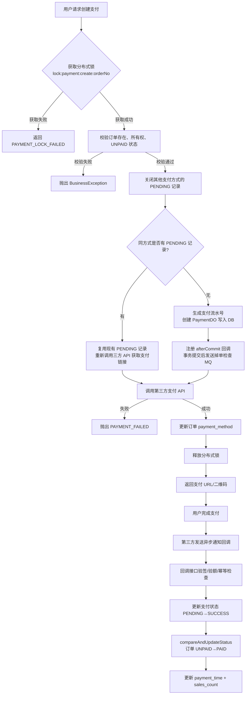
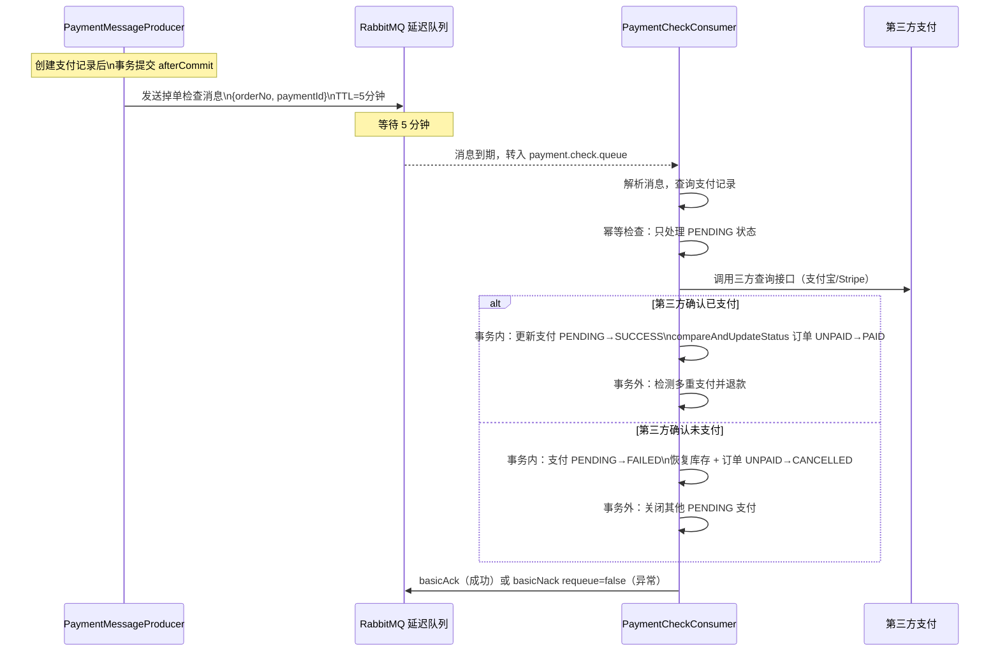

# 支付系统设计

## 目录

- [支付公共流程](#支付公共流程)
- [支付宝集成](#支付宝集成)
- [Stripe 集成](#stripe-集成)
- [微信支付集成](#微信支付集成)
- [幂等设计](#幂等设计)
- [掉单补偿机制](#掉单补偿机制)
- [多重支付检测与自动退款](#多重支付检测与自动退款)
- [CLOSED 状态竞态处理](#closed-状态竞态处理)

---
## 支付模块架构


## 支付公共流程



---

## 支付宝集成

**支付方式：** PC 扫码支付（`alipay.trade.page.pay`，`FAST_INSTANT_TRADE_PAY`）

### 创建支付流程

```java
// AlipayPaymentServiceImpl.java
AlipayTradePagePayRequest request = new AlipayTradePagePayRequest();
request.setNotifyUrl(alipayConfig.getNotifyUrl());  // 异步通知地址
request.setReturnUrl(alipayConfig.getReturnUrl());  // 同步跳转地址

AlipayTradePagePayModel model = new AlipayTradePagePayModel();
model.setOutTradeNo(paymentNo);      // 支付流水号（系统唯一标识）
model.setTotalAmount(totalAmount);   // 支付金额
model.setSubject(subject);           // 商品标题（≤256字符）
model.setBody(body);                 // 商品描述（≤128字符）
model.setProductCode("FAST_INSTANT_TRADE_PAY");

AlipayTradePagePayResponse response = alipayClient.pageExecute(request);
// response.getBody() 返回 HTML 支付表单，前端直接渲染
```

**支付标题构建规则：**
- 单商品：`{商品名称} x{数量} - 订单{订单号}`
- 多商品：`{首个商品名称}等{N}件商品 - 订单{订单号}`
- 超过 256 字符时截断并加 `...`

### 异步通知验签

支付宝异步通知到达 `/api/v1/payment/alipay/notify` 时：

```java
// AlipayPaymentServiceImpl.handleNotify()
// 1. RSA 验签（rsaCheckV1 会修改 params，移除 sign/sign_type）
boolean signVerified = AlipaySignature.rsaCheckV1(
    params,
    alipayConfig.getAlipayPublicKey(),
    alipayConfig.getCharset(),  // UTF-8
    alipayConfig.getSignType()  // RSA2
);

// 2. 金额验证
if (payment.getAmount().compareTo(new BigDecimal(totalAmount)) != 0) {
    return "failure"; // 金额不匹配拒绝
}

// 3. 处理交易状态
// TRADE_SUCCESS / TRADE_FINISHED → 支付成功
// TRADE_CLOSED → 交易关闭
```

**注意事项：** `rsaCheckV1` 会原地修改 `params` Map，移除 `sign` 和 `sign_type` 字段，因此验签前如需记录完整参数需先复制。

### 关单可忽略子错误码

当调用支付宝关单 API 失败时，以下子错误码视为"已关闭"，不抛异常：

| 子错误码 | 含义 |
|---------|------|
| `ACQ.TRADE_NOT_EXIST` | 交易在支付宝端从未创建（用户生成链接但未跳转）|
| `ACQ.TRADE_HAS_CLOSE` | 交易已经被关闭过 |
| `ACQ.REASON_TRADE_STATUS_INVALID` | 交易状态不允许关闭（已退款等终态）|

---

## Stripe 集成

**支付方式：** Checkout Session + Adaptive Pricing

### 创建 Checkout Session

```java
// StripeServiceImpl.java
Stripe.apiKey = stripeSecretKey;

SessionCreateParams params = SessionCreateParams.builder()
    .setMode(SessionCreateParams.Mode.PAYMENT)
    .setSuccessUrl(successUrl + "?session_id={CHECKOUT_SESSION_ID}")
    .setCancelUrl(cancelUrl)
    .setCurrency("usd")
    // 自适应定价（adaptive_pricing）支持多币种
    .setAdaptivePricing(SessionCreateParams.AdaptivePricing.builder()
        .setEnabled(true).build())
    .addAllLineItem(lineItems)
    .putMetadata("paymentNo", paymentNo)
    .putMetadata("orderNo", orderNo)
    .build();

Session session = Session.create(params);
// session.getUrl() 为 Stripe 托管的支付页面 URL
// session.getId() 为 Stripe Session ID（作为 trade_no 存储）
```

### Webhook 处理

Stripe 通过 Webhook 推送支付结果到 `/api/v1/payment/stripe/webhook`：

```java
// 1. 验证 Webhook 签名
Event event = Webhook.constructEvent(payload, sigHeader, webhookSecret);

// 2. 处理事件类型
switch (event.getType()) {
    case "checkout.session.completed":
        // 支付成功处理
    case "checkout.session.expired":
        // Session 过期处理
}
```

**Adaptive Pricing：** 允许 Stripe 根据用户所在国家/地区自动调整显示货币，实际扣款金额通过 Session 的 `amount_total` 字段获取。

### 退款

```java
RefundCreateParams refundParams = RefundCreateParams.builder()
    .setPaymentIntent(paymentIntentId)
    .setAmount(amountInCents)  // 金额单位为分
    .build();
Refund refund = Refund.create(refundParams);
```

---

rue` 时注册 `WxPayServiceImpl`（`@ConditionalOnProperty`），未配置微信支付时此 Service 不存在。

```java
o);
request.setNotifyUrl(wxPayConfig.getNotifyUrl());

Amount amount = new Amount();
amount.setTotal(totalFen);  // 微信支付金额单位为分
amount.setCurrency("CNY");
request.setAmount(amount);

PrepayResponse response = nativePayService.prepay(request);
// response.getCodeUrl() 为微信二维码链接
```
---

## 幂等设计

### 创建支付的幂等保证

同一订单多次调用创建支付接口时，通过以下策略保证幂等：

**第一步：关闭其他支付方式的 PENDING 记录（支付方式互斥）**
```java
// PaymentCloseService.closeAllPendingPayments()
// 查询所有 PENDING 记录，过滤掉当前支付方式后逐个关单
List<PaymentDO> pendingPayments = paymentMapper.findPendingByOrderNo(orderNo);
for (PaymentDO p : pendingPayments) {
    if (!currentMethod.equals(p.getPaymentMethod())) {
        closePayment(p); // 调用对应三方关单 API + 更新本地状态为 CLOSED
    }
}
```

**第二步：查询同方式 PENDING 记录，存在则复用**
```java
// 查找同方式的 PENDING 记录
PaymentDO existingPayment = paymentMapper.findPendingByOrderNo(orderNo).stream()
    .filter(p -> PaymentMethod.ALIPAY.name().equals(p.getPaymentMethod()))
    .findFirst()
    .orElse(null);

if (existingPayment != null) {
    // 复用已有流水号，重新调用三方 API 获取最新支付链接
    return buildResponseFromExisting(existingPayment, newPayUrl);
}
// 否则创建新支付记录
```

### 回调通知的幂等保证

```java
// 幂等性检查：SUCCESS 状态收到重复通知直接返回 success
if (PaymentStatus.SUCCESS.name().equals(payment.getPaymentStatus())) {
    log.warn("支付已完成，忽略重复通知 - 支付流水号: {}", outTradeNo);
    return "success";
}
```

---

## 掉单补偿机制

掉单是指支付已在第三方完成，但因网络抖动等原因导致异步通知未到达服务端。

### 补偿流程



### 消息发送时机

支付消息在**事务提交后**通过 `TransactionSynchronization.afterCommit()` 回调发送，防止事务回滚后消息已发出但支付记录不存在：

```java
// AlipayPaymentServiceImpl.java
TransactionSynchronizationManager.registerSynchronization(new TransactionSynchronization() {
    @Override
    public void afterCommit() {
        paymentMessageProducer.sendPaymentCheckDelayMessage(orderNo, paymentId);
    }
});
```

---

## 多重支付检测与自动退款

在极端情况下（支付回调延迟、掉单补偿与回调几乎同时处理），同一订单可能存在多条 `SUCCESS` 支付记录。

### 检测策略

`PaymentCheckConsumer` 在补偿成功后调用 `detectAndRefundDuplicatePayments()`：

```java
private void detectAndRefundDuplicatePayments(String orderNo) {
    List<PaymentDO> successPayments = paymentMapper.findSuccessListByOrderNo(orderNo);
    if (successPayments == null || successPayments.size() <= 1) {
        return; // 无多重支付
    }
    // 按 created_at ASC 排序，保留最后一条（最新的），对前面的发起退款
    for (int i = 0; i < successPayments.size() - 1; i++) {
        PaymentDO duplicate = successPayments.get(i);
        paymentService.refundByPaymentNo(duplicate.getPaymentNo(), "多重支付自动退款");
    }
}
```

**保留策略：** 保留最后一条成功支付（按 `created_at ASC` 最后一条为最新），对其余成功支付发起退款。

---

## CLOSED 状态竞态处理

当支付单已被关闭（状态为 `CLOSED`）但用户仍在支付宝端完成了支付时，支付宝会推送 `TRADE_SUCCESS` 通知给已关闭的支付单。

### 处理流程

```java
// AlipayPaymentServiceImpl.handleNotify()
// 检测 CLOSED 状态收到 SUCCESS 通知的情况
if (PaymentStatus.CLOSED.name().equals(payment.getPaymentStatus())
        && ("TRADE_SUCCESS".equals(tradeStatus) || "TRADE_FINISHED".equals(tradeStatus))) {

    log.warn("已关闭的支付单收到支付成功通知，将自动退款 - 支付流水号: {}, 交易号: {}",
             outTradeNo, tradeNo);

    // 1. 更新 trade_no（退款 API 需要三方交易号）
    payment.setTradeNo(tradeNo);
    payment.setNotifyTime(LocalDateTime.now());
    paymentMapper.updateById(payment);

    // 2. 发起退款
    String refundNo = OrderNoGenerator.generateOrderNo();
    boolean refundSuccess = refund(refundNo, tradeNo, payment.getAmount(), "支付单已关闭，自动退款");

    // 3. 退款成功后更新状态为 REFUNDED
    if (refundSuccess) {
        payment.setPaymentStatus(PaymentStatus.REFUNDED.name());
        paymentMapper.updateById(payment);
    }
    return "success"; // 必须返回 success，否则支付宝会持续重试通知
}
```

**关键点：** 无论退款是否成功，回调接口都必须返回 `"success"` 避免支付宝重复推送。退款失败的情况需要人工介入处理。
