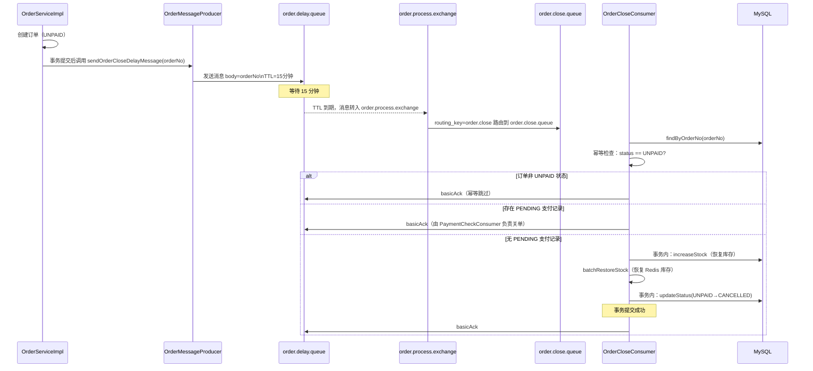
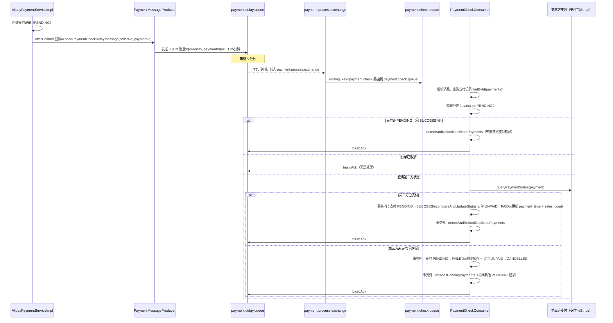

# 消息队列设计

## 目录

- [整体架构图](#整体架构图)
- [链路 A：订单超时关闭](#链路-a订单超时关闭)
- [链路 B：掉单补偿检查](#链路-b掉单补偿检查)
- [消息发送时机](#消息发送时机)
- [失败处理策略](#失败处理策略)
- [队列配置常量](#队列配置常量)

---

## 整体架构图

本项目采用**死信队列（DLQ）模式**实现延迟消息，无需安装 RabbitMQ 延迟插件：

```
链路 A：订单超时关闭（TTL = 15 分钟）
┌─────────────────────┐    routing_key=order.delay
│  order.delay.exchange│ ─────────────────────────► order.delay.queue
└─────────────────────┘                              │ TTL=15min 到期
                                                     │ x-dead-letter-exchange
                                                     ▼
┌──────────────────────┐   routing_key=order.close
│order.process.exchange│ ◄───────────────────────── (DLX 转发)
└──────────────────────┘
          │
          │ routing_key=order.close
          ▼
    order.close.queue
          │
          ▼
   OrderCloseConsumer
   （执行超时关单逻辑）


链路 B：掉单补偿检查（TTL = 5 分钟）
┌──────────────────────┐  routing_key=payment.delay
│payment.delay.exchange│ ──────────────────────────► payment.delay.queue
└──────────────────────┘                              │ TTL=5min 到期
                                                      │ x-dead-letter-exchange
                                                      ▼
┌──────────────────────────┐  routing_key=payment.check
│ payment.process.exchange │ ◄──────────────────────── (DLX 转发)
└──────────────────────────┘
             │
             │ routing_key=payment.check
             ▼
       payment.check.queue
             │
             ▼
      PaymentCheckConsumer
      （主动查询三方支付状态）
```

---

## 链路 A：订单超时关闭

### 时序图



### 幂等检查机制

`OrderCloseConsumer` 中包含两层幂等检查：

**第一层：** 订单状态检查
```java
if (!OrderStatus.UNPAID.getCode().equals(order.getStatus())) {
    log.info("订单已非 UNPAID 状态，跳过超时关闭 - 订单号: {}, 当前状态: {}",
             orderNo, order.getStatus());
    return; // 已被支付成功或其他流程关闭，跳过
}
```

**第二层：** PENDING 支付记录检查
```java
List<PaymentDO> pendingPayments = paymentMapper.findPendingByOrderNo(orderNo);
if (pendingPayments != null && !pendingPayments.isEmpty()) {
    // 有 PENDING 支付，说明掉单补偿消费者尚在处理中
    // 跳过，由 PaymentCheckConsumer 负责关单
    return;
}
```

### 编程式事务 + 手动 ACK

```java
@RabbitListener(queues = RabbitMQConfig.ORDER_CLOSE_QUEUE)
public void handleOrderClose(String orderNo, Channel channel,
                              @Header(AmqpHeaders.DELIVERY_TAG) long deliveryTag) {
    try {
        transactionTemplate.executeWithoutResult(status -> {
            // 执行数据库操作（幂等检查、恢复库存、更新状态）
        });
        // 事务成功提交后才 ACK
        channel.basicAck(deliveryTag, false);
    } catch (Exception e) {
        log.error("处理订单超时关闭消息异常 - 订单号: {}", orderNo, e);
        channel.basicNack(deliveryTag, false, false); // 不重新入队
    }
}
```

---

## 链路 B：掉单补偿检查

### 时序图



### 事务内外分离

`PaymentCheckConsumer` 将第三方 HTTP 调用与数据库操作分离：

```java
// 5. 向第三方查询实际支付状态（事务外执行，避免长事务持锁）
final boolean isPaid = queryThirdPartyPaymentStatus(payment);

if (isPaid) {
    // 6a. 事务内：更新本地状态
    transactionTemplate.executeWithoutResult(status -> {
        payment.setPaymentStatus(PaymentStatus.SUCCESS.name());
        paymentMapper.updateById(payment);
        orderMapper.compareAndUpdateStatus(orderNo, "UNPAID", "PAID");
        // 更新销量...
    });
    // 事务外：多重支付检测（有自己的事务，不能嵌套）
    detectAndRefundDuplicatePayments(orderNo);

} else {
    // 6b. 分两步：先事务内操作，再事务外关单
    boolean needClose = transactionTemplate.execute(status -> {
        // 更新支付 FAILED + 恢复库存 + 取消订单
        return true;
    });
    if (needClose) {
        paymentCloseService.closeAllPendingPayments(orderNo); // 涉及 HTTP 调用
    }
}
```

**分离原因：** 第三方支付 API 调用（HTTP 网络请求）不能放在数据库事务内，否则会导致数据库连接长时间持有，增加连接池压力。

---

## 消息发送时机

所有 RabbitMQ 消息均在**数据库事务提交后**发送，通过 `TransactionSynchronization.afterCommit()` 回调实现：

### 订单创建后（15 分钟超时关单）

```java
// OrderServiceImpl.java（事务内注册回调）
TransactionSynchronizationManager.registerSynchronization(new TransactionSynchronization() {
    @Override
    public void afterCommit() {
        orderMessageProducer.sendOrderCloseDelayMessage(orderNo);
    }
});
```

### 支付记录创建后（5 分钟掉单补偿）

```java
// AlipayPaymentServiceImpl.java（事务内注册回调）
final Long paymentId = payment.getId();
TransactionSynchronizationManager.registerSynchronization(new TransactionSynchronization() {
    @Override
    public void afterCommit() {
        paymentMessageProducer.sendPaymentCheckDelayMessage(orderNo, paymentId);
    }
});
```

**为何在 afterCommit 中发送：**
若在事务提交前发送消息，消费者可能在事务回滚之前就开始处理，读取到不存在的数据。`afterCommit` 保证消息发出时数据库记录已持久化。

---

## 失败处理策略

### 消费者异常处理

```java
// 消费成功 → ACK
channel.basicAck(deliveryTag, false);

// 消费异常 → NACK，不重新入队
channel.basicNack(deliveryTag, false, false);
// requeue=false：消息不重回队列
// multiple=false：只拒绝当前消息
```

**为何不重新入队：**
- 幂等逻辑已保证重复处理安全，但不重入队可防止 bug 导致的死循环消费
- 生产环境可配置死信队列接收这些消息，人工排查后决定是否重新处理

### 消息发送失败处理

```java
// OrderMessageProducer.java
public void sendOrderCloseDelayMessage(String orderNo) {
    try {
        rabbitTemplate.convertAndSend(...);
    } catch (Exception e) {
        log.error("发送订单超时关闭延迟消息失败 - 订单号: {}", orderNo, e);
        // 发送失败时仅记录日志，不抛异常（不影响创建订单主流程）
        // 降级：订单可能不会被自动关闭，需依赖定时任务或人工处理
    }
}
```

---

## 队列配置常量

所有队列/交换机名称定义在 `config/RabbitMQConfig.java`：

```java
// 订单超时关闭
ORDER_DELAY_EXCHANGE  = "order.delay.exchange"
ORDER_DELAY_QUEUE     = "order.delay.queue"      // TTL=900000ms（15分钟）
ORDER_DELAY_ROUTING_KEY = "order.delay"

ORDER_PROCESS_EXCHANGE = "order.process.exchange"
ORDER_CLOSE_QUEUE      = "order.close.queue"     // 消费者监听
ORDER_CLOSE_ROUTING_KEY = "order.close"

// 掉单补偿
PAYMENT_DELAY_EXCHANGE  = "payment.delay.exchange"
PAYMENT_DELAY_QUEUE     = "payment.delay.queue"  // TTL=300000ms（5分钟）
PAYMENT_DELAY_ROUTING_KEY = "payment.delay"

PAYMENT_PROCESS_EXCHANGE = "payment.process.exchange"
PAYMENT_CHECK_QUEUE      = "payment.check.queue" // 消费者监听
PAYMENT_CHECK_ROUTING_KEY = "payment.check"
```

### 延迟队列 Queue 参数

```java
// order.delay.queue 配置
QueueBuilder.durable(ORDER_DELAY_QUEUE)
    .withArgument("x-message-ttl", 15 * 60 * 1000)       // TTL=15分钟
    .withArgument("x-dead-letter-exchange", ORDER_PROCESS_EXCHANGE)  // 死信转发目标
    .withArgument("x-dead-letter-routing-key", ORDER_CLOSE_ROUTING_KEY) // 死信路由键
    .build();

// payment.delay.queue 配置（TTL=5分钟）
QueueBuilder.durable(PAYMENT_DELAY_QUEUE)
    .withArgument("x-message-ttl", 5 * 60 * 1000)
    .withArgument("x-dead-letter-exchange", PAYMENT_PROCESS_EXCHANGE)
    .withArgument("x-dead-letter-routing-key", PAYMENT_CHECK_ROUTING_KEY)
    .build();
```
