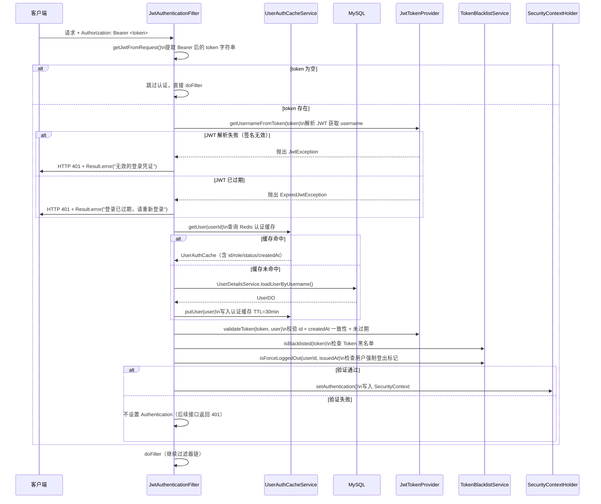

# 安全与横切设计

## 目录

- [JWT 认证完整链路](#jwt-认证完整链路)
- [Token 黑名单机制](#token-黑名单机制)
- [用户强制登出](#用户强制登出)
- [SecurityConfig 路径权限矩阵](#securityconfig-路径权限矩阵)
- [@CurrentUserId 参数注入原理](#currentuserid-参数注入原理)
- [AOP 横切关注点](#aop-横切关注点)

---

## JWT 认证完整链路



### JWT Token 载荷

```json
{
  "sub": "12345",               // 用户 ID（subject，唯一且不可变）
  "username": "john",           // 用户名（仅作展示，不用于验证）
  "email": "john@example.com",  // 邮箱（仅作展示，不用于验证）
  "createdAt": 1700000000000,   // 用户注册时间毫秒戳（用于验证 token 真实性）
  "iat": 1700010000,            // 签发时间
  "exp": 1700096400             // 过期时间
}
```

### Token 验证策略（性能优先）

不在每次请求时查询数据库验证 username/email（这两个字段可变），只验证不可变字段：

```java
// JwtTokenProvider.validateToken()
public boolean validateToken(String token, UserDO user) {
    Long tokenUserId = getUserIdFromToken(token);
    Long tokenCreatedAt = getCreatedAtFromToken(token);

    // 1. 校验 id 一致（防止 token 中 id 被篡改）
    if (!tokenUserId.equals(user.getId())) return false;

    // 2. 校验 createdAt 一致（防止伪造 token：id 猜对但 createdAt 不对）
    long dbCreatedAt = user.getCreatedAt().atZone(ZoneId.systemDefault()).toInstant().toEpochMilli();
    if (!tokenCreatedAt.equals(dbCreatedAt)) return false;

    // 3. 校验未过期
    return !isTokenExpired(token);
}
```

---

## Token 黑名单机制

**实现类：** `util/TokenBlacklistService.java`

### SHA-256 哈希

Token 字符串通常超过 200 字符，直接作为 Redis Key 浪费内存。使用 SHA-256 前 16 位 hex（8 字节）作为 Key：

```java
private String hashToken(String token) {
    MessageDigest digest = MessageDigest.getInstance("SHA-256");
    byte[] hashBytes = digest.digest(token.getBytes(StandardCharsets.UTF_8));
    StringBuilder sb = new StringBuilder();
    for (int i = 0; i < 8; i++) {
        sb.append(String.format("%02x", hashBytes[i]));
    }
    return sb.toString(); // 16 字符 hex，如 "a1b2c3d4e5f6a7b8"
}
```

### 黑名单写入与检查

```java
// 写入：TTL = token 剩余有效期（token 过期后自动从 Redis 删除，无需额外清理）
public void blacklist(String token, Date expiresAt) {
    long remainingMs = expiresAt.getTime() - System.currentTimeMillis();
    if (remainingMs <= 0) return; // 已过期，无需写入
    stringRedisTemplate.opsForValue().set(
        "auth:blacklist:" + hashToken(token), "1", remainingMs, TimeUnit.MILLISECONDS
    );
}

// 检查：O(1) 查询
public boolean isBlacklisted(String token) {
    return Boolean.TRUE.equals(
        stringRedisTemplate.hasKey("auth:blacklist:" + hashToken(token))
    );
}
```

### 异常降级

Redis 不可用时，黑名单查询降级为**放行**（可用性优先），避免因 Redis 故障导致所有用户无法访问：

```java
} catch (Exception e) {
    log.warn("查询 token 黑名单异常 - hash: {}，降级为放行", hash, e);
    return false; // 降级：视为未在黑名单
}
```

---

## 用户强制登出

当管理员执行禁用用户、修改角色等操作时，写入用户级强制登出标记：

```
Redis Key: auth:force-logout:{userId}
Value: System.currentTimeMillis()（毫秒时间戳）
TTL: 24 小时
```

### 验证逻辑

```java
public boolean isForceLoggedOut(Long userId, long tokenIssuedAt) {
    String value = stringRedisTemplate.opsForValue().get("auth:force-logout:" + userId);
    if (value == null) return false; // 无强制登出标记
    long forceLogoutAt = Long.parseLong(value);
    // token 签发时间早于强制登出时间 → token 已失效
    return tokenIssuedAt < forceLogoutAt;
}
```

这种设计的优势：
- 不需要为每个 Token 单独写黑名单
- 只需一个 Key 就能使该用户在此时间点之前签发的所有 Token 失效
- 管理员重新启用用户时，调用 `clearForceLogout(userId)` 删除该标记即可

---

## SecurityConfig 路径权限矩阵

**配置类：** `config/SecurityConfig.java`

| 路径模式 | 访问权限 | 说明 |
|---------|---------|------|
| `/api/v1/auth/**` | 完全公开 | 登录、注册、Token 刷新 |
| `/api/v1/health` | 完全公开 | 健康检查 |
| `/api/v1/categories/**` | 完全公开 | 分类列表（管理操作需 ADMIN）|
| `/api/v1/products/**` | 完全公开 | 商品列表/详情（管理操作需 ADMIN）|
| `/api/v1/payment/alipay/notify` | 完全公开 | 支付宝异步通知（第三方回调）|
| `/api/v1/payment/alipay/return` | 完全公开 | 支付宝同步跳转 |
| `/api/v1/payment/wechat/notify` | 完全公开 | 微信支付回调 |
| `/api/v1/payment/wechat/refund/notify` | 完全公开 | 微信退款回调 |
| `/api/v1/payment/stripe/webhook` | 完全公开 | Stripe 支付 Webhook |
| `/api/v1/payment/stripe/refund/webhook` | 完全公开 | Stripe 退款 Webhook |
| `/api-docs/**` | 完全公开 | OpenAPI 文档 JSON |
| `/swagger-ui/**` | 完全公开 | Swagger UI |
| `/api/v1/user/**` | `ROLE_USER` | 用户相关接口（购物车、订单、地址等）|
| `/api/v1/admin/**` | `ROLE_ADMIN` | 后台管理接口 |
| 其他所有路径 | 已认证 | 需要有效 JWT |

### 全局安全策略

```java
http
    .cors(cors -> cors.configurationSource(corsConfigurationSource()))  // 允许跨域
    .csrf(AbstractHttpConfigurer::disable)                               // 禁用 CSRF（无状态 JWT）
    .sessionManagement(session -> session
        .sessionCreationPolicy(SessionCreationPolicy.STATELESS))         // 无状态 Session
    .addFilterBefore(jwtAuthenticationFilter,                            // JWT 过滤器在前
        UsernamePasswordAuthenticationFilter.class);
```

### CORS 配置

```java
configuration.setAllowedOriginPatterns(Arrays.asList("*")); // 允许所有来源
configuration.setAllowedMethods(Arrays.asList("GET", "POST", "PUT", "DELETE", "OPTIONS"));
configuration.setAllowedHeaders(Arrays.asList("*")); // 允许所有请求头（含 Authorization）
configuration.setAllowCredentials(true);  // 允许携带认证信息
configuration.setMaxAge(3600L);           // 预检请求缓存 1 小时
// 仅注册到 /api/** 路径
source.registerCorsConfiguration("/api/**", configuration);
```

---

## @CurrentUserId 参数注入原理

`@CurrentUserId` 注解配合 `CurrentUserIdResolver` 实现 Controller 方法参数的自动注入，无需每个接口手动从 `SecurityContextHolder` 获取用户 ID。

### 使用示例

```java
@GetMapping("/orders")
public Result<List<OrderVO>> getOrders(@CurrentUserId Long userId) {
    // userId 由 CurrentUserIdResolver 自动注入，无需手动获取
    return Result.success(orderService.getUserOrders(userId));
}
```

### 实现原理

`CurrentUserIdResolver` 实现 Spring MVC 的 `HandlerMethodArgumentResolver` 接口：

```java
// CurrentUserIdResolver.java
@Component
public class CurrentUserIdResolver implements HandlerMethodArgumentResolver {

    // 1. 判断是否支持解析该参数（有 @CurrentUserId 注解且类型为 Long）
    @Override
    public boolean supportsParameter(MethodParameter parameter) {
        return parameter.hasParameterAnnotation(CurrentUserId.class)
                && Long.class.isAssignableFrom(parameter.getParameterType());
    }

    // 2. 解析参数值：从 SecurityContext 提取用户 ID
    @Override
    public Object resolveArgument(MethodParameter parameter, ...) {
        var authentication = SecurityContextHolder.getContext().getAuthentication();
        if (authentication == null) {
            throw new BusinessException(ResultCode.UNAUTHORIZED, "用户未登录");
        }
        SecurityUser securityUser = (SecurityUser) authentication.getPrincipal();
        return securityUser.getUser().getId(); // 返回用户 ID，Spring MVC 注入到参数中
    }
}
```

---

## AOP 横切关注点

本项目通过 AOP 实现日志记录、接口限流和敏感数据脱敏等横切关注点，对业务代码无侵入。

### AccessLogAspect — 访问日志切面

**切入点：** 所有 `@RestController` 方法，排除 `@IgnoreLog` 注解的方法

**日志内容：** HTTP 方法、URI、客户端 IP、用户 ID、请求参数、响应状态码、处理时间

**日志名：** `ACCESS_LOG`（日志框架中独立配置输出路径）

```java
// 切入点定义
@Pointcut("within(@org.springframework.web.bind.annotation.RestController *) " +
          "&& !@annotation(site.geekie.shop.shoppingmall.annotation.IgnoreLog)")
public void accessLogPointcut() {}

// 日志格式
// POST /api/v1/orders | ip=127.0.0.1 | userId=12345 | params={...} | status=200 | 52ms
```

**参数脱敏：** 通过 `SensitiveFieldSerializer.serialize()` 序列化参数，对标注 `@SensitiveField` 的字段进行脱敏处理。

### BusinessLogAspect — 业务日志切面

**切入点：** 所有标注 `@LogOperation` 注解的方法

**注解参数：**

| 参数 | 类型 | 说明 |
|------|------|------|
| `value` | String | 操作描述 |
| `module` | String | 所属模块（可选）|
| `logParams` | boolean | 是否记录入参（默认 true）|
| `logResult` | boolean | 是否记录返回值（默认 false，避免日志体积过大）|

**使用示例：**

```java
@LogOperation(value = "创建订单", module = "订单管理", logParams = true)
public OrderVO createOrder(CreateOrderDTO dto, Long userId) {
    // 业务代码
}
// 日志：[订单管理] 创建订单 | OrderServiceImpl.createOrder | params={...} | 127ms
```

**日志名：** `BUSINESS_LOG`（与 ACCESS_LOG 分开配置，便于独立存储）

### RateLimiterAspect — 接口限流切面

**切入点：** 所有标注 `@RateLimiter` 注解的方法

**注解参数：**

| 参数 | 类型 | 默认值 | 说明 |
|------|------|--------|------|
| `count` | int | 5 | 窗口内最大请求数 |
| `period` | int | 60 | 窗口时间（秒）|
| `key` | String | 方法名 | 自定义 Key 后缀 |

**Key 构成：**
- 已认证用户：`ratelimit:user:{userId}:{key}`
- 未认证用户：`ratelimit:ip:{clientIp}:{key}`

**使用示例：**

```java
@RateLimiter(count = 3, period = 60, key = "createOrder")
@PostMapping("/orders")
public Result<OrderVO> createOrder(@RequestBody @Valid CreateOrderDTO dto,
                                   @CurrentUserId Long userId) {
    // 每个用户每分钟最多创建 3 个订单
}
```

**降级：** Redis 异常时放行，不影响正常业务。

### SensitiveFieldSerializer — 敏感字段序列化

对标注 `@SensitiveField` 注解的字段在序列化（如日志记录）时进行脱敏处理：

```java
// @SensitiveField 注解定义脱敏类型
public @interface SensitiveField {
    SensitiveType value() default SensitiveType.DEFAULT;
}

// 支持的脱敏类型
public enum SensitiveType {
    PASSWORD,  // 密码：全部替换为 ****
    PHONE,     // 手机号：中间 4 位替换为 ****
    ID_CARD,   // 身份证：中间替换
    EMAIL,     // 邮箱：@ 前字符部分替换
    TOKEN,     // Token：全部替换为 ****
    DEFAULT    // 默认：部分替换
}
```

**使用示例：**

```java
public class LoginDTO {
    private String username;

    @SensitiveField(SensitiveType.PASSWORD)
    private String password; // 日志中显示为 ****
}
```

### IgnoreLog — 跳过访问日志

对不需要记录访问日志的接口（如高频健康检查、文件上传等），使用 `@IgnoreLog` 注解排除：

```java
@IgnoreLog
@GetMapping("/health")
public Result<String> health() {
    return Result.success("OK");
}
```

### AOP 执行顺序

多个 AOP 切面通过 `@Order` 指定执行顺序（数字越小优先级越高）：

| 切面 | @Order | 说明 |
|------|--------|------|
| `AccessLogAspect` | 1 | 最外层，记录整体处理时间 |
| `BusinessLogAspect` | 2 | 内层，记录具体业务操作 |

`RateLimiterAspect` 未设置 `@Order`，默认优先级最低，在业务日志之后执行（超限时抛出异常，由外层切面捕获记录）。
