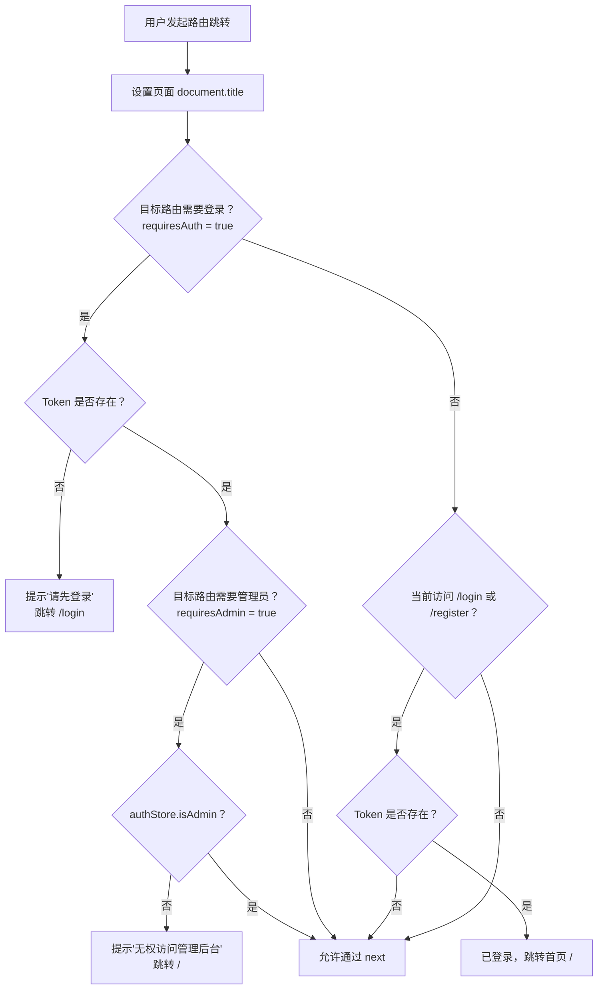

# 路由与导航守卫文档

> 前端页面为Vibe coding产物，未经验证，仅供参考

## 目录

- [路由表结构](#路由表结构)
- [导航守卫逻辑](#导航守卫逻辑)
- [所有页面路由清单](#所有页面路由清单)
- [懒加载策略](#懒加载策略)

---

## 路由表结构

文件路径：`src/router/index.js`

路由表分为三个区块：**用户端路由**、**认证路由**和**管理端路由**，采用嵌套路由结构，布局组件作为父路由，页面组件作为子路由。

```
路由结构
├── /                    ← UserLayout（用户端布局）
│   ├── （空路径）        ← Home 首页
│   ├── /products        ← ProductList 商品列表
│   ├── /products/:id    ← ProductDetail 商品详情
│   ├── /cart            ← Cart 购物车          [requiresAuth]
│   ├── /checkout        ← Checkout 结算        [requiresAuth]
│   ├── /orders          ← OrderList 我的订单    [requiresAuth]
│   ├── /orders/:orderNo ← OrderDetail 订单详情  [requiresAuth]
│   ├── /payment/:orderNo      ← Payment 支付      [requiresAuth]
│   ├── /payment/stripe/result ← Stripe 支付结果   [requiresAuth]
│   ├── /payment/result        ← PaymentResult      [requiresAuth]
│   ├── /profile         ← Profile 个人中心      [requiresAuth]
│   └── /address         ← Address 地址管理      [requiresAuth]
│
├── /login               ← Login 登录页
├── /register            ← Register 注册页
│
├── /admin               ← AdminLayout（管理端布局）[requiresAuth + requiresAdmin]
│   ├── （空路径）        ← Dashboard 数据概览
│   ├── products         ← ProductManage 商品管理
│   ├── categories       ← CategoryManage 分类管理
│   ├── orders           ← OrderManage 订单管理
│   ├── orders/:orderNo  ← AdminOrderDetail 订单详情
│   └── users            ← UserManage 用户管理
│
└── /:pathMatch(.*)*     ← NotFound 404 页面
```

---

## 导航守卫逻辑

路由守卫使用全局 `beforeEach` 钩子，在每次路由跳转前执行。



### 守卫代码说明

```javascript
router.beforeEach((to, from, next) => {
  const token = getToken()

  // 1. 设置页面标题
  document.title = to.meta.title ? `${to.meta.title} - Spring Mall` : 'Spring Mall'

  // 2. 登录检查：目标路由标记了 requiresAuth 且无 Token
  if (to.meta.requiresAuth && !token) {
    ElMessage.warning('请先登录')
    next('/login')
    return
  }

  // 3. 角色检查：目标路由标记了 requiresAdmin
  if (to.meta.requiresAdmin) {
    const authStore = useAuthStore()
    if (!authStore.isAdmin) {
      ElMessage.error('无权访问管理后台')
      next('/')
      return
    }
  }

  // 4. 已登录用户访问 /login 或 /register，重定向到首页
  if ((to.path === '/login' || to.path === '/register') && token) {
    next('/')
    return
  }

  next()
})
```

### Route Meta 字段说明

| 字段 | 类型 | 说明 |
|------|------|------|
| `title` | `string` | 页面标题，自动设置 `document.title` |
| `requiresAuth` | `boolean` | 是否需要登录，未登录时跳转 `/login` |
| `requiresAdmin` | `boolean` | 是否需要管理员角色，非管理员跳转首页 |

### 管理端路由保护机制

管理端路由有两层防护：

1. **父路由层**：`/admin` 路由本身配置了 `requiresAuth: true` 和 `requiresAdmin: true`，子路由自动继承
2. **守卫层**：`beforeEach` 中检查 `authStore.isAdmin`（即 `user.role === 'ADMIN'`）

即使用户持有有效 Token，若角色不是 `ADMIN`，也无法访问任何 `/admin/*` 路径。

---

## 所有页面路由清单

### 用户端路由（UserLayout）

| 路由名称 | 路径 | 组件 | 需要登录 | 页面标题 |
|---------|------|------|---------|---------|
| `Home` | `/` | `views/user/Home.vue` | 否 | 首页 |
| `ProductList` | `/products` | `views/user/ProductList.vue` | 否 | 商品列表 |
| `ProductDetail` | `/products/:id` | `views/user/ProductDetail.vue` | 否 | 商品详情 |
| `Cart` | `/cart` | `views/user/Cart.vue` | 是 | 购物车 |
| `Checkout` | `/checkout` | `views/user/Checkout.vue` | 是 | 结算 |
| `OrderList` | `/orders` | `views/user/OrderList.vue` | 是 | 我的订单 |
| `OrderDetail` | `/orders/:orderNo` | `views/user/OrderDetail.vue` | 是 | 订单详情 |
| `Payment` | `/payment/:orderNo` | `views/user/Payment.vue` | 是 | 订单支付 |
| `StripePaymentResult` | `/payment/stripe/result` | `views/user/StripePaymentResult.vue` | 是 | 支付结果 |
| `PaymentResult` | `/payment/result` | `views/user/PaymentResult.vue` | 是 | 支付结果 |
| `Profile` | `/profile` | `views/user/Profile.vue` | 是 | 个人中心 |
| `Address` | `/address` | `views/user/Address.vue` | 是 | 地址管理 |

### 认证路由（独立，无 Layout）

| 路由名称 | 路径 | 组件 | 需要登录 | 页面标题 |
|---------|------|------|---------|---------|
| `Login` | `/login` | `views/auth/Login.vue` | 否（已登录跳首页） | 登录 |
| `Register` | `/register` | `views/auth/Register.vue` | 否（已登录跳首页） | 注册 |

### 管理端路由（AdminLayout，全部需要 ADMIN 角色）

| 路由名称 | 路径 | 组件 | 需要登录 | 需要管理员 | 页面标题 |
|---------|------|------|---------|----------|---------|
| `Dashboard` | `/admin` | `views/admin/Dashboard.vue` | 是（继承） | 是（继承） | 管理后台 |
| `ProductManage` | `/admin/products` | `views/admin/ProductManage.vue` | 是（继承） | 是（继承） | 商品管理 |
| `CategoryManage` | `/admin/categories` | `views/admin/CategoryManage.vue` | 是（继承） | 是（继承） | 分类管理 |
| `OrderManage` | `/admin/orders` | `views/admin/OrderManage.vue` | 是（继承） | 是（继承） | 订单管理 |
| `AdminOrderDetail` | `/admin/orders/:orderNo` | `views/admin/AdminOrderDetail.vue` | 是（继承） | 是（继承） | 订单详情 |
| `UserManage` | `/admin/users` | `views/admin/UserManage.vue` | 是（继承） | 是（继承） | 用户管理 |

### 其他路由

| 路由名称 | 路径 | 组件 | 说明 |
|---------|------|------|------|
| `NotFound` | `/:pathMatch(.*)*` | `views/NotFound.vue` | 捕获所有未匹配路径，显示 404 页面 |

---

## 懒加载策略

项目中**所有路由组件**均采用动态导入（懒加载），只有在路由被首次访问时才加载对应的 JS chunk：

```javascript
// 所有路由组件均使用箭头函数 + 动态 import()
{
  path: '/products',
  component: () => import('@/views/user/ProductList.vue')
}
```

**懒加载的优点：**

- 减小初始 bundle 体积，加快首屏加载速度
- 按需加载，用户只下载访问过的页面代码
- 配合 Vite 的代码分割，每个页面组件生成独立的 chunk 文件

**注意：** 布局组件（`UserLayout.vue`、`AdminLayout.vue`）同样是懒加载的，用户端和管理端的布局代码在各自首次进入时分别加载。
