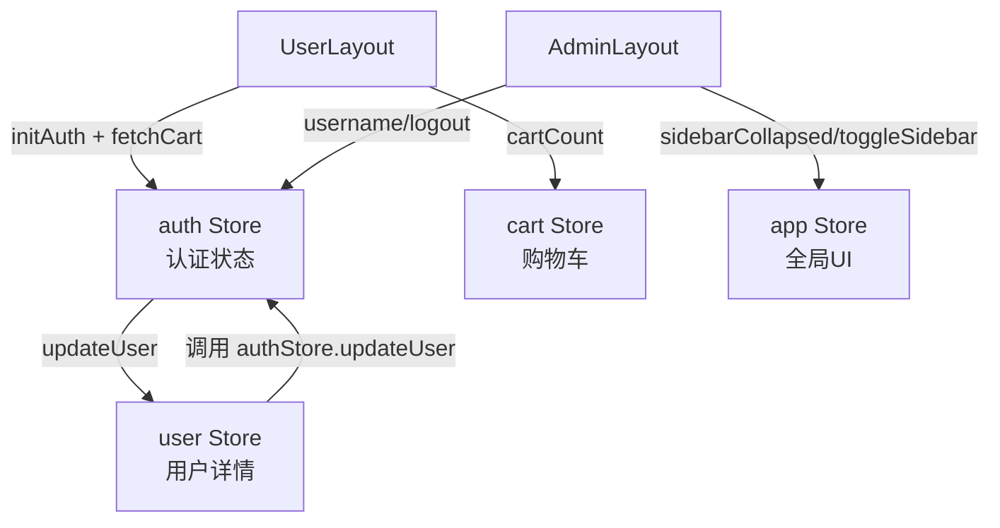
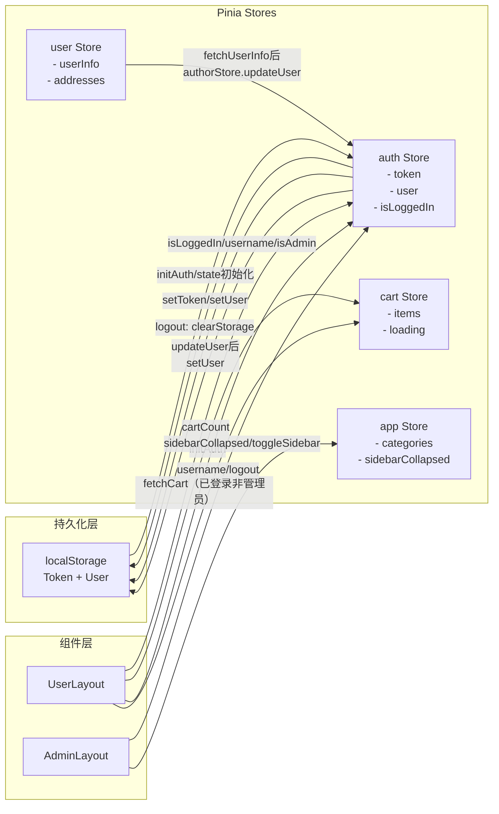

# 状态管理文档

> 前端页面为Vibe coding产物，未经验证，仅供参考

## 目录

- [概览](#概览)
- [Store 详解](#store-详解)
  - [auth — 认证状态](#auth--认证状态)
  - [cart — 购物车状态](#cart--购物车状态)
  - [user — 用户信息](#user--用户信息)
  - [app — 全局 UI 状态](#app--全局-ui-状态)
- [持久化策略](#持久化策略)
- [Store 间交互关系](#store-间交互关系)

---

## 概览

项目使用 **Pinia** 进行状态管理，采用 Options 风格的 `defineStore`（`state` / `getters` / `actions`），共有 4 个 Store：

| Store 名称 | 文件 | 职责 |
|-----------|------|------|
| `auth` | `src/store/auth.js` | 认证状态：Token、用户基础信息、登录/注册/登出 |
| `cart` | `src/store/cart.js` | 购物车：商品列表、选中状态、数量、价格计算 |
| `user` | `src/store/user.js` | 用户详情：个人信息、收货地址列表 |
| `app` | `src/store/app.js` | 全局 UI：加载状态、分类缓存、侧边栏折叠、设备类型 |



---

## Store 详解

### auth — 认证状态

文件：`src/store/auth.js`

认证 Store 是整个应用的权限基础，管理 JWT Token 和用户基础信息。

#### State

```javascript
state: () => ({
  user: getUser(),          // 从 localStorage 恢复的用户对象（含 role 字段）
  token: getToken(),        // 从 localStorage 恢复的 JWT Token 字符串
  isLoggedIn: !!getToken()  // 是否已登录（布尔值）
})
```

| 字段 | 类型 | 说明 |
|------|------|------|
| `user` | `Object \| null` | 用户对象，包含 `username`、`role` 等字段 |
| `token` | `string \| null` | JWT Token 字符串 |
| `isLoggedIn` | `boolean` | 登录状态，根据 Token 是否存在初始化 |

#### Getters

| Getter | 返回值 | 说明 |
|--------|--------|------|
| `isAdmin` | `boolean` | `user.role === 'ADMIN'` |
| `username` | `string` | 用户名，未登录返回空字符串 |
| `userRole` | `string` | 用户角色，未登录返回空字符串 |

#### Actions

**`login(credentials)`**

```javascript
// credentials: { username, password }
await authStore.login({ username: 'admin', password: '123456' })
// 登录成功后：保存 Token 和用户信息到 state + localStorage，根据角色跳转页面
// 管理员 → /admin，普通用户 → /
```

**`register(userInfo)`**

```javascript
// userInfo: { username, email, password }
await authStore.register({ username: 'test', email: 'test@example.com', password: '123456' })
// 注册成功后：弹出确认弹窗，用户点击后跳转 /login
```

**`logout()`**

```javascript
await authStore.logout()
// 发送登出请求（即使失败也继续），清除 state 和 localStorage，跳转 /login
```

**`initAuth()`**

```javascript
authStore.initAuth()
// 从 localStorage 恢复 Token 和 user，用于页面刷新后恢复登录状态
// 在 UserLayout 的 setup 阶段调用
```

**`updateUser(user)`**

```javascript
authStore.updateUser(updatedUserData)
// 更新 state 中的 user 并同步写入 localStorage
// 由 userStore.updateUserInfo / fetchUserInfo 调用
```

---

### cart — 购物车状态

文件：`src/store/cart.js`

购物车 Store 管理购物车中的所有商品，并提供多个计算属性供 UI 使用。

#### State

```javascript
state: () => ({
  items: [],       // 购物车商品列表
  loading: false   // 加载状态
})
```

| 字段 | 类型 | 说明 |
|------|------|------|
| `items` | `Array` | 购物车项数组，每项含 `id`、`productId`、`productPrice`、`quantity`、`checked` 等 |
| `loading` | `boolean` | 正在加载购物车数据时为 `true` |

#### Getters

| Getter | 返回值 | 计算逻辑 |
|--------|--------|---------|
| `cartCount` | `number` | 所有商品数量之和（含未选中），用于导航栏徽章显示 |
| `checkedItems` | `Array` | 已选中的商品列表 |
| `checkedCount` | `number` | 已选中商品的数量之和 |
| `checkedTotal` | `number` | 已选中商品的总价（`productPrice × quantity` 之和） |
| `isAllChecked` | `boolean` | 是否全选（items 非空且全部已选中） |

#### Actions

| Action | 参数 | 说明 |
|--------|------|------|
| `fetchCart()` | 无 | 从服务器获取购物车列表，更新 `items` |
| `addItem(productId, quantity)` | `productId: number, quantity: number = 1` | 加入购物车，成功后重新拉取列表 |
| `updateQuantity(id, quantity)` | `id: number, quantity: number` | 更新某条购物车项的数量，同时更新本地 state |
| `removeItem(id)` | `id: number` | 删除购物车项，同时从本地 `items` 中过滤 |
| `toggleCheck(id, checked)` | `id: number, checked: boolean` | 切换单条商品选中状态，`boolean` 转换为 `0/1` 发送给后端 |
| `toggleCheckAll(checked)` | `checked: boolean` | 全选/取消全选，更新所有商品选中状态 |
| `clearCart()` | 无 | 清空本地 `items`（仅清本地，不发请求，下单后调用） |

**本地更新与服务器同步策略：**

- `addItem`：调用接口后触发 `fetchCart()` 重新拉取，确保数据与服务器一致
- `updateQuantity`、`removeItem`、`toggleCheck`、`toggleCheckAll`：接口成功后直接修改本地 state，不重新拉取，减少请求次数

---

### user — 用户信息

文件：`src/store/user.js`

用户 Store 管理比 auth Store 更详细的用户数据，以及收货地址列表。

#### State

```javascript
state: () => ({
  userInfo: null,     // 完整用户信息对象
  addresses: [],      // 收货地址列表
  loading: false      // 加载状态
})
```

| 字段 | 类型 | 说明 |
|------|------|------|
| `userInfo` | `Object \| null` | 完整的用户信息（比 auth.user 包含更多字段，如手机号、头像等） |
| `addresses` | `Array` | 收货地址列表，含 `isDefault` 标记 |
| `loading` | `boolean` | 请求进行中为 `true` |

#### Getters

| Getter | 返回值 | 说明 |
|--------|--------|------|
| `defaultAddress` | `Object \| undefined` | 标记了 `isDefault` 的地址，如无则返回第一个地址 |

#### Actions

**`fetchUserInfo()`**

```javascript
const userInfo = await userStore.fetchUserInfo()
// 获取完整用户信息，并同步调用 authStore.updateUser() 更新 auth Store
```

**`updateUserInfo(data)`**

```javascript
const updated = await userStore.updateUserInfo({ nickname: '新昵称', phone: '138xxxx' })
// 更新用户信息，成功后同步更新 userInfo 和 authStore.user，显示"信息更新成功"
```

**`fetchAddresses()`**

```javascript
const addresses = await userStore.fetchAddresses()
// 获取收货地址列表，存入 addresses
```

---

### app — 全局 UI 状态

文件：`src/store/app.js`

app Store 管理全局性的 UI 状态，不与具体业务绑定。

#### State

```javascript
state: () => ({
  globalLoading: false,      // 全局加载遮罩状态
  categories: [],            // 商品分类列表缓存
  sidebarCollapsed: false,   // 管理端侧边栏是否折叠
  device: 'desktop'          // 设备类型：'desktop' | 'mobile'
})
```

| 字段 | 类型 | 说明 |
|------|------|------|
| `globalLoading` | `boolean` | 全局加载遮罩开关 |
| `categories` | `Array` | 商品分类列表，从服务器获取后缓存，避免重复请求 |
| `sidebarCollapsed` | `boolean` | 管理端侧边栏折叠状态，AdminLayout 读取此值 |
| `device` | `'desktop' \| 'mobile'` | 当前设备类型，根据窗口宽度检测（< 768px 为移动端） |

#### Getters

| Getter | 返回值 | 说明 |
|--------|--------|------|
| `isMobile` | `boolean` | `device === 'mobile'` |

#### Actions

| Action | 参数 | 说明 |
|--------|------|------|
| `setGlobalLoading(loading)` | `loading: boolean` | 控制全局加载遮罩 |
| `fetchCategories()` | 无 | 从服务器获取分类列表，缓存到 `categories` |
| `toggleSidebar()` | 无 | 切换管理端侧边栏折叠状态 |
| `setDevice(device)` | `device: string` | 手动设置设备类型 |
| `detectDevice()` | 无 | 根据 `window.innerWidth` 自动检测并设置设备类型（< 768px → mobile） |

---

## 持久化策略

Pinia 本身不自动持久化，项目通过 `src/utils/storage.js` 手动管理 localStorage。

### 持久化内容

| 存储键 | 内容 | 读取函数 | 写入函数 | 清除函数 |
|--------|------|---------|---------|---------|
| Token 键 | JWT Token 字符串 | `getToken()` | `setToken(token)` | `removeToken()` |
| User 键 | 用户信息对象（JSON 序列化） | `getUser()` | `setUser(user)` | - |

### 持久化时机

**写入：**
- 登录成功（`authStore.login`）：同时调用 `setToken()` 和 `setUser()`
- 用户信息更新（`authStore.updateUser`）：调用 `setUser()`

**读取：**
- auth Store 的 `state` 初始化时从 localStorage 读取（应用启动即恢复）
- `authStore.initAuth()`：UserLayout 挂载时调用，二次确认恢复状态

**清除：**
- 登出（`authStore.logout`）：调用 `clearStorage()` 清除所有缓存
- Token 过期（Axios 响应拦截器检测到 401）：调用 `clearStorage()` 并跳转登录

### 不持久化的状态

- `cart.items`：购物车数据每次从服务器拉取，不持久化
- `user.userInfo` / `user.addresses`：按需从服务器拉取，不持久化
- `app.*`：UI 状态（侧边栏折叠、设备类型等）每次重置为默认值

---

## Store 间交互关系



### 交互说明

1. **auth ↔ user**：`userStore.fetchUserInfo()` 和 `userStore.updateUserInfo()` 完成后，会调用 `authStore.updateUser()` 同步更新 auth Store 中的用户信息，确保两个 Store 中的用户数据一致。

2. **auth → localStorage**：所有认证数据的持久化操作（读写清除）由 auth Store 统一管理，其他 Store 不直接操作 localStorage。

3. **UserLayout 初始化**：UserLayout 在 setup 阶段调用 `authStore.initAuth()` 恢复登录状态，并在已登录且非管理员时调用 `cartStore.fetchCart()` 初始化购物车，避免普通用户看到空购物车。

4. **AdminLayout ↔ app Store**：侧边栏折叠状态由 app Store 管理，AdminLayout 读取并触发 `toggleSidebar()`，实现布局与状态分离。
